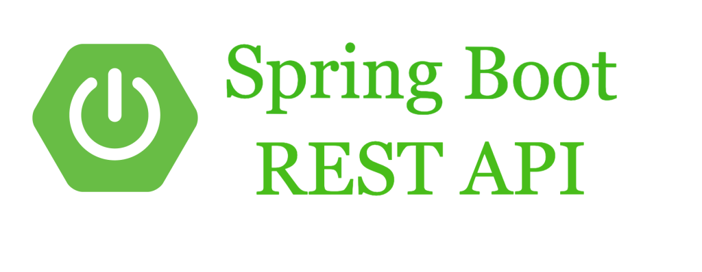

# Challenge BackEnd - REST API

| API REST |  SpringBoot | Spring JPA | Hibernate | MySQL |

# Tecnologías Utilizadas:

- API REST con SpringBoot
- Spring JPA y Hibernate
- MySQL como gestor de base de datos

# Características Principales:

- Conversión de datos
    - Esta API es un ejercicio que consiste en desarrollar una aplicación monolítica en Java que aborde los desafíos de escalabilidad, modularidad y mantenibilidad del código en un proyecto a gran escala. 

Debe contener:
- Conversión de SQL a Excel:
    - Una funcionalidad para convertir los datos del SQL a uno o varios archivos Excel
(CSV)
- Controladores - Desarrollar tres controladores con las siguientes características:
    - Controlador basado en Excel
    - Controlador basado en Base de Datos
    - Controlador híbrido (Excel y Base de Datos)
- Operaciones CRUD
    - Las operaciones CRUD deben cubrir las siguientes funcionalidades:
        - Provincias
            - Crear una nueva provincia.
            - Leer información de una provincia a partir de su nombre, ID o código 31662.
            - Actualizar información de una provincia existente.
            - Eliminar una provincia.
        - Ciudades
            - Crear una nueva ciudad.
            - Leer información de una ciudad a partir de su nombre, ID o código postal.
            - Actualizar información de una ciudad existente.
            - Eliminar una ciudad.

# Endpoints:

<!-- - GET /api/v1/product/all: Obtiene todos los productos.
- POST /api/v1/product/post: Agrega un nuevo producto.
- PUT /api/v1/product/put/{id}: Actualiza un producto existente.
- DELETE /api/v1/product/delete/{id}: Elimina un producto.
- GET /api/v1/product/id/{id}: Obtiene un producto por su ID.
- GET /api/v1/product/search/{search}: Busca productos por nombre, referencia o categoría.
- GET /api/v1/product/export/pdf: Genera un reporte en formato PDF de todos los productos.
- GET /api/v1/product/export/excel: Genera un reporte en formato Excel de todos los productos. -->